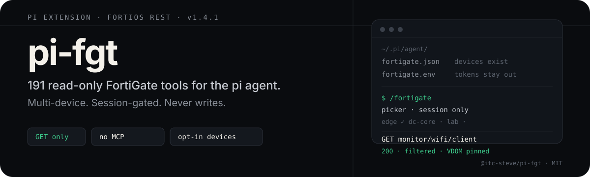
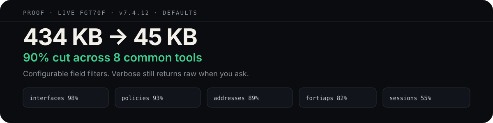
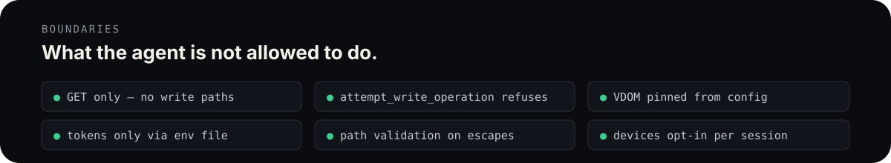
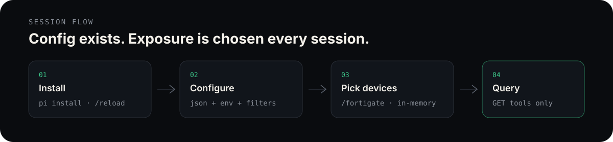

<p align="center">
  
</p>

<p align="center">
  <a href="https://www.npmjs.com/package/@itc-steve/pi-fgt"></a>
  <a href="./LICENSE"></a>
  
  
</p>

> **Not affiliated with Fortinet.** Independent open-source project. FortiGate, FortiOS, FortiAP, FortiSwitch, FortiGuard, and related names are trademarks of Fortinet, Inc.

## What it is

**pi-fgt** is a [pi](https://github.com/badlogic/pi-mono) coding-agent extension that turns FortiOS REST into 191 typed, read-only tools. Point it at one FortiGate or many. The model only sees the devices you pick for *this* session. It never writes.

No MCP server. No write verbs. Tokens stay in env files.

## Proof

<p align="center">
  
</p>

| tool | raw | filtered | cut |
|------|-----|----------|-----|
| `get_interfaces_config` | 178.9 KB | 3.9 KB | 98% |
| `get_firewall_policies` | 41.0 KB | 2.7 KB | 93% |
| `get_address_objects` | 168.5 KB | 17.7 KB | 89% |
| `get_fortiaps` | 9.0 KB | 1.6 KB | 82% |
| `get_firewall_sessions` | 14.5 KB | 6.5 KB | 55% |

Measured on a live FGT70F (v7.4.12), default filters. Flip any group off in `fortigate-filters.json` when you need the raw fields back. `verbose=true` still returns full records.

## Guarantees

<p align="center">
  
</p>

- GET only
- `attempt_write_operation` refuses with no network I/O
- VDOM pinned from device config — caller cannot override
- Path/name validation on escape hatches and ids
- Response size cap + configurable field filtering
- Tokens only via env / `fortigate.env`
- Device exposure is opt-in per session, in-memory, never persisted

## How it works

<p align="center">
  
</p>

Three files side by side. Config defines what *exists*. The picker decides what the AI *sees*.

| File | Purpose |
|------|---------|
| `~/.pi/agent/fortigate.json` | Device names, URL, VDOM, `tokenEnv` **name**, `sessionDefault` (no secrets) |
| `~/.pi/agent/fortigate.env` | Actual tokens as `KEY=value` |
| `~/.pi/agent/fortigate-filters.json` | Which response fields reach the AI (optional — defaults apply if absent) |

**Every FortiGate is hidden from the AI by default, every session.** `/fortigate` opens a picker (↑↓ move, enter/space toggle, `/` search, esc done). Unselected devices are invisible to the model — not listed by `list_fortigate_devices`, not resolvable by any tool. You still see all of them in the picker.

Selection is in-memory and per pi session:

- Nothing written to disk — no state file, no save command
- Other pi terminals are unaffected
- `/new`, restart, or `/fortigate off` → back to all-hidden
- **No config setting can pre-select a device**

## Install

```bash
pi install npm:@itc-steve/pi-fgt
```

From a local checkout:

```bash
pi install /path/to/pi-fgt
```

Then `/reload`.

### First session

```bash
cp /path/to/pi-fgt/fortigate.json.example ~/.pi/agent/fortigate.json
cp /path/to/pi-fgt/fortigate.env.example  ~/.pi/agent/fortigate.env
chmod 600 ~/.pi/agent/fortigate.env
# optional — only if you want to change what gets filtered out:
cp /path/to/pi-fgt/fortigate-filters.example.json ~/.pi/agent/fortigate-filters.json
```

`fortigate.json`:

```json
{
  "sessionDefault": "off",
  "maxResponseBytes": 24000,
  "devices": {
    "edge": {
      "url": "https://fw01.example.com:443",
      "tokenEnv": "FORTIGATE_EDGE_TOKEN",
      "vdom": "root",
      "verifySsl": false
    }
  }
}
```

`fortigate.env` (secrets):

```bash
FORTIGATE_EDGE_TOKEN=your-rest-api-token
```

Token resolve order:

1. `process.env[tokenEnv]` (shell export wins if set)
2. `~/.pi/agent/fortigate.env` key matching `tokenEnv`

Never put the token string in the JSON.

### Session commands

| Command | Effect |
|---------|--------|
| `/fortigate` or `/fortigate on` | Enable tools **and open the device picker** |
| `/fortigate off` | Disable tools and clear device selection |
| `/fortigate toggle` | Off → on+picker, on → off |
| `/fortigate status` | Show on/off + which devices the AI can see |
| `/fortigate filters` | Show which response fields are excluded |

Set `"sessionDefault": "on"` to auto-activate tools each session; devices still start hidden until you run `/fortigate`.

Every tool accepts optional `device` (name key). Omit only when exactly one device is selected. Names match case-insensitively, by unique substring, and by word tokens (`edge` or `edge fw` → `edge-fw`). Ambiguous input lists candidates instead of guessing.

## Tools

191 read-only tools. GET only. Prefer typed tools over guessing escape-hatch paths.

| Area | File | Coverage |
|------|------|----------|
| System / health | `system.ts`, `system_health.ts` | status, resources, performance, storage, VM, vdom, processes, NTP, PoE, transceivers, FQDN |
| System / fabric | `system_fabric.ts` | Security Fabric, HA, cluster/SLBC, FortiManager, sandbox, SDN, botnet, config revisions |
| Network | `network.ts`, `misc.ts` | routing, ARP, DHCP, sessions, policy hits, LLDP, DNS, DDNS |
| Router | `router.ts` | IPv6 RIB, BGP, OSPF, policy routes, SD-WAN routes, route lookup |
| Firewall (config) | `firewall.ts` | policies, addresses, services, VIPs, ippools, routes, interfaces, zones |
| Firewall (live) | `firewall_monitor.ts` | ACL/DNAT/SNAT stats, proxy sessions, shapers, LB health |
| VPN / SD-WAN | `vpn.ts`, `sdwan_vpn.ts` | IPsec, SSL-VPN, SD-WAN health/members/SLA |
| Wireless | `wireless.ts`, `wifi.ts` | FortiAPs, clients, rogue APs, stats, firmware, NAC |
| Switch | `switch.ts`, `switch_monitor.ts` | FortiSwitch status/ports, health, PoE, NAC devices |
| Users | `users.ts` | firewall/proxy users, banned, device store, FSSO, FortiToken |
| UTM / endpoint | `security.ts`, `utm_endpoint.ts` | UTM profiles, AV/IPS/webfilter stats, EMS, wanopt |
| Admin / logs | `admin.ts`, `logs.ts`, `misc.ts` | admins, profiles, logs, license/FortiGuard, FortiView |
| Escape | `escape.ts` | generic cmdb/monitor GET + write refusal |

All 288 documented FortiOS 7.4 GET endpoints are either a typed tool or reachable via `get_config_object` / `get_monitor_resource`.

## Response filters

Every context-reduction rule lives in one config file. No hardcoded field lists remain in `src/tools/`.

```bash
cp fortigate-filters.example.json ~/.pi/agent/fortigate-filters.json
```

Run `/fortigate filters` to see what is currently excluded. Responses that lost fields carry a `_filtered` stamp naming the groups.

<details>
<summary><strong>Filter precedence, groups, and defaults</strong></summary>

Precedence, first match wins:

1. `tools.<name>.keep[]` — always survives
2. `tools.<name>.allowlist[]` — ONLY these fields are returned (strongest)
3. `dropKeys` / `dropPrefixes` / `dropSuffixes` — explicit + group rules
4. `dropValues` — `byValue` placeholders, `disableDefaults`
5. `dropEmpty` — empty string / array / object / null

A field in an `allowlist` is immune to rule 4, so a meaningful default like `logtraffic: "disable"` is never silently dropped.

### Structural groups

Four reductions *reshape* a payload rather than drop keys:

| group | what it does | tools |
|-------|--------------|-------|
| `apps_compact` | `apps:[{id,name,protocol,port}]` → `["udp/53"]` | sessions, fortiview |
| `resource_history` | CPU/mem time series → `current` + one sample | resource usage, performance |
| `switch_port_counts` | `ports[]` → `port_count` / `ports_up` | `get_fortiswitches` |
| `ipsec_compact` | `proxyid[]` trees → `phase2[]` + derived status | `get_ipsec_tunnels` |

```jsonc
{ "groups": { "resource_history": { "exclude": false } } }  // full CPU series
```

### Limits

```jsonc
"limits": {
  "maxResponseBytes": null,   // null = defer to fortigate.json
  "maxArrayItems": 20,        // array trim size when a payload is over budget
  "maxExpandRequests": 40     // fan-out cap for get_fqdn_addresses
}
```

### Getting data back

Every noise family is a named group with a `why`. Flip one boolean:

```jsonc
{ "groups": { "uuid": { "exclude": false } } }   // UUIDs return everywhere
```

Re-enabling a group also re-admits its fields past a tool allowlist. To lift an allowlist entirely:

```jsonc
{ "tools": { "get_firewall_policies": { "allowlist": null } } }
```

Your file is deep-merged over the defaults — only specify what you change. Invalid JSON falls back to defaults with a warning rather than breaking tools.

### Defaults worth knowing

- **Excluded:** `uuid`, ZTNA, IPv6 blocks, DiffServ/ToS, PPTP/L2TP, `*-negate`, duplicate identity fields, FortiOS internal indexes, `switch-controller-*`, WiFi MCS/rate-score telemetry
- **Kept on purpose:** `country`/`srcmac` on sessions, `noise` on WiFi clients
- **`verbose=true` returns raw records.** Set `audit.verboseBypassesFilters: false` to keep filtering even on verbose calls

Still prefer query filters (`source_ip`, `name=`, `up_only=true`) before dumping catalogs.

</details>

## Notes

**Session-scoped device exposure (v1.2).** Device visibility used to live in `~/.pi/agent/fortigate.state.json` and was rewritten globally across terminals. That file is gone. Selection is in-memory, per session, all-hidden until you pick. Safe to delete any leftover `fortigate.state.json`.

**FortiOS 7.6.** Some monitor endpoints relocated; the client surfaces relocation hints on 404. See [`docs/fortios-version-notes.md`](./docs/fortios-version-notes.md).

## License

[MIT](./LICENSE) © [itc-steve](https://github.com/itc-steve)
